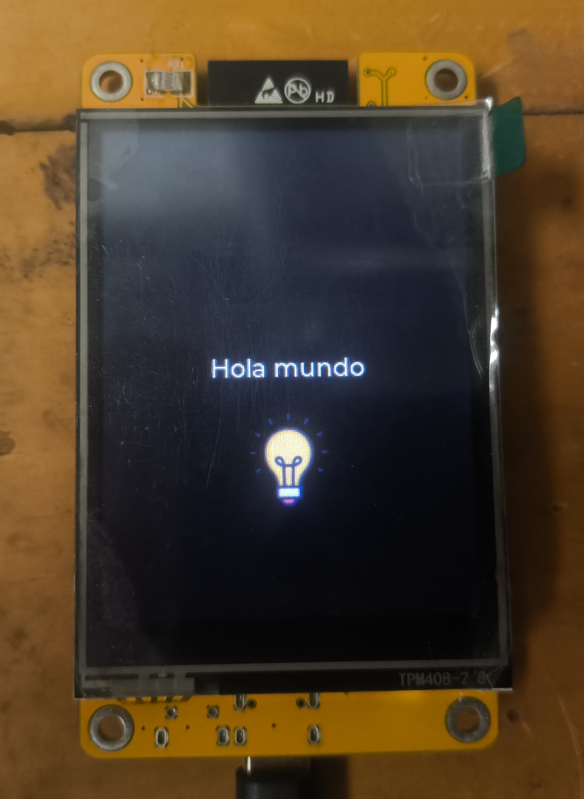

# CYD ST7789 — MicroPython + LVGL

Firmware de **MicroPython + LVGL** preparado específicamente para la **ESP32-2432S028**, equipada con una pantalla táctil **ST7789 de 240×320 píxeles**.

El objetivo de este proyecto es proporcionar un firmware ya configurado para esta variante de la CYD, permitiendo comenzar a desarrollar proyectos con **MicroPython y LVGL** sin tener que compilar ni configurar todo desde cero.

---

## ⚠️ Compatibilidad

> **Este firmware está diseñado específicamente para la versión ST7789 de la ESP32-2432S028.**

No lo instales en variantes de la CYD que utilicen otro controlador de pantalla, como **ILI9341**.

Antes de instalarlo, asegúrate de que tu placa utiliza:

- **ST7789**
- Resolución **240×320**
- Touch **XPT2046**

---

## ✨ Características

El firmware viene preparado para trabajar directamente con:

- 🐍 **MicroPython**
- 🎨 **LVGL**
- 🖥️ **ST7789**
- 👆 **XPT2046**

La idea es poder empezar a desarrollar aplicaciones e interfaces gráficas directamente desde MicroPython, sin tener que configurar manualmente todos los componentes necesarios.

---

## 🔧 Hardware

| Componente | Especificación |
|---|---|
| Placa | ESP32-2432S028 |
| Pantalla | ST7789 |
| Resolución | 240×320 |
| Touch | XPT2046 |

### Pantalla ST7789

| Función | GPIO |
|---|---:|
| MOSI | 13 |
| MISO | 12 |
| SCK | 14 |
| CS | 15 |
| DC | 2 |
| Backlight | 21 |

### Touch XPT2046

| Función | GPIO |
|---|---:|
| MOSI | 32 |
| MISO | 39 |
| SCK | 25 |
| CS | 33 |

---

## 📦 Firmware

Las versiones compiladas del firmware están disponibles en **GitHub Releases**.

Cada release incluye su archivo `.bin` y la información necesaria para instalar la versión correspondiente.

---

## 🐍 Ejemplo

En `examples/simple.py` encontrarás un ejemplo mínimo para comprobar que el firmware funciona correctamente.

Ejecuta `simple.py` en la placa.

Si todo funciona correctamente, aparecerá:

**Hola mundo**

---

## 🧪 Estado del proyecto

**En desarrollo.**

El firmware se prueba directamente en una **ESP32-2432S028 con ST7789**.

Otras variantes de CYD pueden utilizar diferentes controladores, pines o configuraciones y podrían no ser compatibles.

---

## 📚 Créditos

Este proyecto utiliza:

- [MicroPython](https://micropython.org/)
- [LVGL](https://lvgl.io/)

Este firmware no es oficial de **MicroPython**, **LVGL**, **Espressif** ni **Sunton**.

---

## 👤 Autor

Desarrollado por **Andreeu3000**.

---
